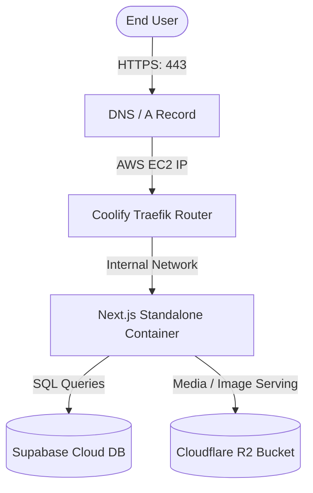

# 🚀 Ultimate AWS EC2 & Coolify Production Deployment Guide

This guide provides a comprehensive, step-by-step walkthrough to host and deploy the **PVideo** Next.js application on Amazon Web Services (AWS) using **Coolify** (a self-hosted Heroku/PaaS alternative).

---

## 🗺️ High-Level Infrastructure Overview


---

## 📋 Table of Contents
1. [Step 1: Provisioning the AWS EC2 Virtual Machine](#step-1-provisioning-the-aws-ec2-virtual-machine)
2. [Step 2: Connecting and Securing the EC2 Instance](#step-2-connecting-and-securing-the-ec2-instance)
3. [Step 3: Installing Coolify Control Panel](#step-3-installing-coolify-control-panel)
4. [Step 4: DNS Configuration (Linking Your Domain)](#step-4-dns-configuration-linking-your-domain)
5. [Step 5: Setup Coolify and GitHub Integration](#step-5-setup-coolify-and-github-integration)
6. [Step 6: Deploying the PVideo Application](#step-6-deploying-the-pvideo-application)
7. [Step 7: Production Troubleshooting & Maintenance](#step-7-production-troubleshooting--maintenance)

---

## 💻 Step 1: Provisioning the AWS EC2 Virtual Machine

1. Log in to the [AWS Console](https://console.aws.amazon.com/).
2. In the top search bar, type **EC2** and click the EC2 service.
3. Click on the orange **Launch Instance** button.
4. **Name and Tags**:
   * Key: `Name` | Value: `pvideo-production-host`
5. **Application and OS Image (AMI)**:
   * Select **Ubuntu Server 22.04 LTS** (HVM, SSD Volume Type).
6. **Instance Type**:
   * Select **`t3.medium`** (2 vCPUs, 4GB RAM) or **`t3.large`** (2 vCPUs, 8GB RAM).
   * > [!IMPORTANT]
     > Do **NOT** use `t2.micro` or `t3.micro`. Next.js builds compile dynamically using TypeScript and webpack; compiling requires at least 2.5GB of RAM, otherwise the process will hang and freeze your instance.
7. **Key Pair (Login)**:
   * Click **Create new key pair**.
   * Key pair name: `pvideo-production-key`
   * Private key file format: `.pem`
   * Click **Create key pair** and save the downloaded file to a secure directory (e.g., `C:\Users\username\.ssh\`).
8. **Network Settings (Firewall)**:
   * Select **Create security group**.
   * Security Group Name: `pvideo-security-group`
   * Description: `Security Group for Coolify and PVideo App`
   * Configure **Inbound Security Group Rules**:
     
     | Type | Port Range | Source | Description |
     | :--- | :--- | :--- | :--- |
     | **SSH** | `22` | `My IP` or `Anywhere` | Terminal Access |
     | **HTTP** | `80` | `0.0.0.0/0` | Web Traffic (Cert verification) |
     | **HTTPS** | `443` | `0.0.0.0/0` | Secure SSL Web Traffic |
     | **Custom TCP** | `8000` | `0.0.0.0/0` | Coolify Admin Panel Dashboard |
     | **Custom TCP** | `6001` | `0.0.0.0/0` | Coolify Realtime WebSockets |

9. **Configure Storage**:
   * Size: **`40 GB`** (General Purpose SSD gp3).
   * Note: Coolify stores multiple build versions and Docker layers. 30–40GB ensures you don't run out of storage after a few deployments.
10. Review your settings and click **Launch Instance**.

---

## 🔑 Step 2: Connecting and Securing the EC2 Instance

Once the instance shows a green **Running** status:
1. Locate its **Public IPv4 Address** (e.g., `54.210.12.34`).
2. Open your terminal (PowerShell or Git Bash) on your local computer.
3. **Important (Permissions)**:
   * If you are on **Linux/macOS**, change permissions on the PEM file:
     ```bash
     chmod 400 /path/to/pvideo-production-key.pem
     ```
   * If you are on **Windows PowerShell**, secure the file so SSH doesn't complain about "unprotected key file":
     ```powershell
     # Disable inheritance and remove access for other users
     icacls.exe ".\pvideo-production-key.pem" /inheritance:r
     icacls.exe ".\pvideo-production-key.pem" /grant:r "$($env:USERNAME):R"
     ```
4. Connect to your instance:
   ```bash
   ssh -i ".\pvideo-production-key.pem" ubuntu@your-aws-instance-public-ip
   ```

---

## 🛠️ Step 3: Installing Coolify Control Panel

1. Update your Ubuntu package lists:
   ```bash
   sudo apt update && sudo apt upgrade -y
   ```
2. Download and run the Coolify installation script. This installs Docker, configures firewall mappings, and pulls the administration containers:
   ```bash
   curl -fsSL https://cdn.coollabs.io/coolify/install.sh | bash
   ```
3. Watch the output. Once completed, it will print:
   `Coolify is ready! Please navigate to http://<your-ip>:8000`

---

## 🌐 Step 4: DNS Configuration (Linking Your Domain)

Before deploying, link your custom domain (e.g., `pvideo.com` or `pvideo.xxx`) to the AWS server:
1. Log in to your domain registrar (GoDaddy, Namecheap, Cloudflare, etc.).
2. Go to the **DNS Zone Editor**.
3. Add an **A Record**:
   * Host/Name: `@` (Root domain)
   * Value/IP: `your-aws-instance-public-ip`
   * TTL: `3600`
4. Add another **A Record** (Optional, for media storage if CDN is mapped directly):
   * Host/Name: `media`
   * Value/IP: `your-aws-instance-public-ip` (or Cloudflare R2 CNAME depending on R2 routing)

---

## ⚙️ Step 5: Setup Coolify and GitHub Integration

1. In your browser, navigate to `http://your-aws-instance-public-ip:8000`.
2. Register the administrator account (email and secure password).
3. On the welcome screen, select **Local server** (the server you just installed Coolify on).
4. Connect GitHub:
   * Go to **Keys & Sources** ➔ **Sources** ➔ **Add New**.
   * Select **GitHub App** and click **Register GitHub App**.
   * Grant access to your repository `ayushchandramola95-cell/Pvideo`.

---

## 🚀 Step 6: Deploying the PVideo Application

1. In the Coolify sidebar, click **Projects** ➔ **Create New Project** ➔ **Default Environment**.
2. Click **Add New Resource** ➔ **GitHub Repository**.
3. Select `ayushchandramola95-cell/Pvideo` and branch `main`.
4. Click **Configure**. Coolify will read the `Dockerfile` in the root of the project automatically and choose **Dockerfile** as the build pack.
5. In the **General Configuration** screen:
   * **Domain**: Set your production domain (e.g., `https://yourproductiondomain.com`). Coolify's built-in Traefik router will automatically generate Let's Encrypt SSL certificates for you!
6. Click **Save**.
7. Go to the **Environment Variables** tab and paste your live environment values:
   ```ini
   # Root URL
   NEXT_PUBLIC_SITE_URL=https://yourproductiondomain.com

   # Supabase Keys
   NEXT_PUBLIC_SUPABASE_URL=https://your-supabase-id.supabase.co
   NEXT_PUBLIC_SUPABASE_ANON_KEY=eyJhbGciOiJIUzI1NiIsInR5cCI...
   SUPABASE_SERVICE_ROLE_KEY=eyJhbGciOiJIUzI1NiIsInR5cCI...

   # Cloudflare R2 S3 Config
   CF_R2_ACCOUNT_ID=your_cloudflare_id
   CF_R2_ACCESS_KEY_ID=your_access_id
   CF_R2_SECRET_ACCESS_KEY=your_secret_key
   CF_R2_BUCKET_NAME=pvideo-media
   NEXT_PUBLIC_R2_PUBLIC_URL=https://media.yourproductiondomain.com
   ```
8. Click **Deploy** at the top right.
9. You can watch the real-time build logs. The multi-stage docker image compiles in about 2 minutes and launches. Your site is live!

---

## 🧪 Step 7: Production Troubleshooting & Maintenance

### 1. High Memory Builds (Swapping)
If Next.js builds get slow or fail on 4GB RAM instances during high-traffic intervals, you can enable a swap file on Ubuntu to add virtual memory:
```bash
# Create a 2GB swap file
sudo fallocate -l 2G /swapfile
sudo chmod 600 /swapfile
sudo mkswap /swapfile
sudo swapon /swapfile

# Make the swap file permanent
echo '/swapfile none swap sw 0 0' | sudo tee -a /etc/fstab
```

### 2. View Server Logs
To check the Next.js runtime logs directly on your Ubuntu server:
```bash
docker ps
# Find container ID, then run:
docker logs -f <container-id>
```

### 3. Clear Build Cache
To force Coolify to pull a clean container and ignore caches, click **Force Redeploy** inside the application dashboard.
